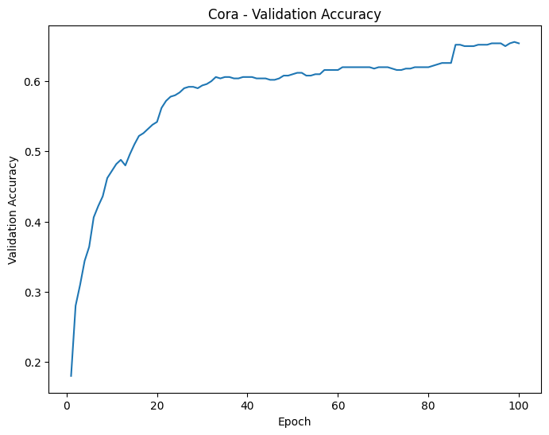
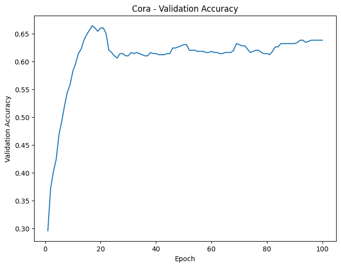
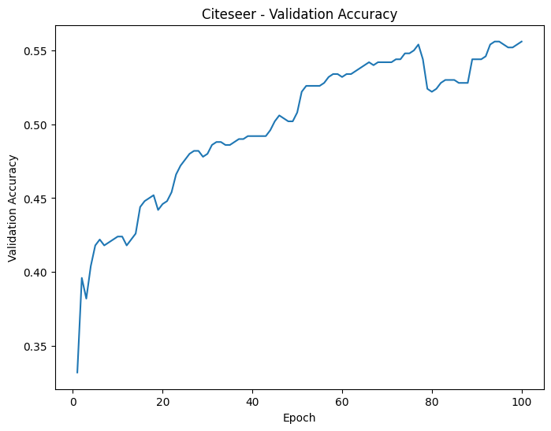
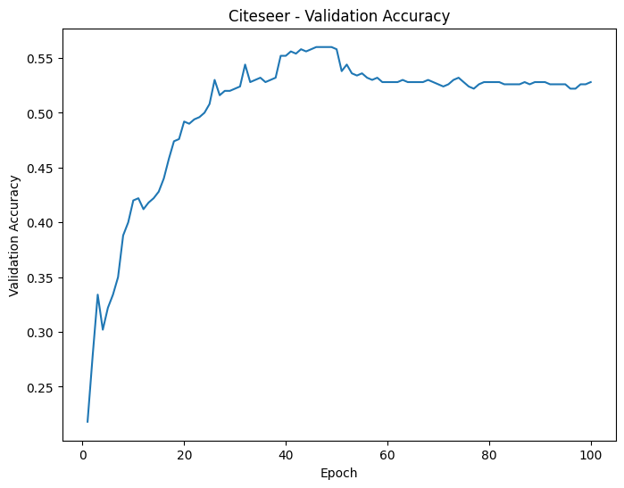
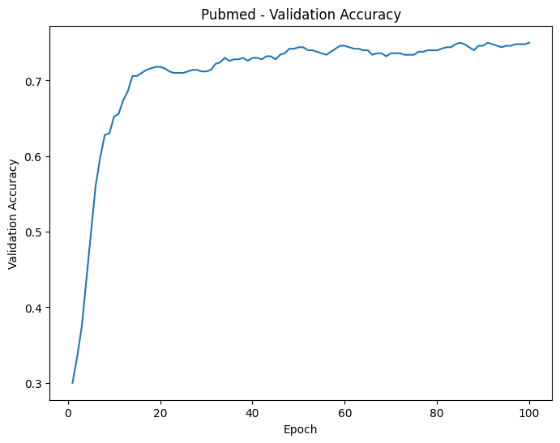
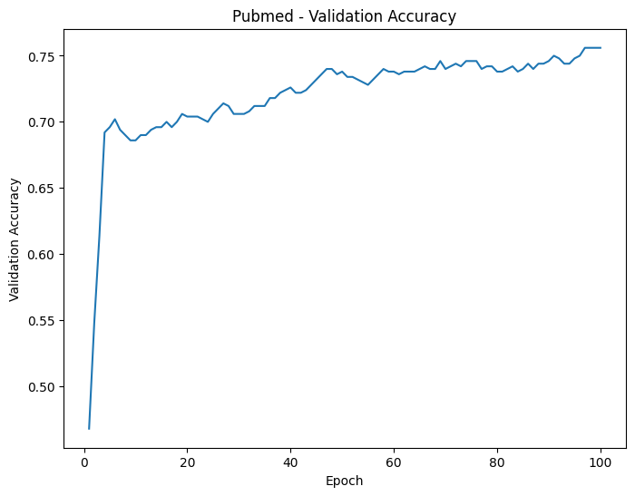

# Graph Attention Networks Reproducibility

## Introduction

본 연구의 목적은 Graph Attention Network (GAT; Velickovic et al., 2017) 원 논문에서 제시된 실험 결과를 재현함. 본 실험은 GAT 모델에서 사용하는 **attention score 계산 시 활성화 함수의 변경이 성능에 미치는 영향**을 평가하고, **다양한 데이터셋에 걸쳐 결과가 재현 가능한지**를 검증하는 데 초점을 맞춤.

research questions:

1. Attention score 계산에 사용하는 활성화 함수를 변경할 경우, 노드 분류 정확도에 어떤 영향을 미치는가?
2. 활성화 함수의 종류에 따라 모델의 수렴 속도에 차이가 있는가?

기존 GAT에서는 인접 노드 간 attention score 계산 시 Leaky ReLU 함수가 사용되었으나, 본 연구에서는 보다 강한 비선형성을 갖는 ELU(Exponential Linear Unit) 함수로 대체하여 실험을 진행함. ELU 함수는 더 복잡한 패턴을 포착할 수 있으므로, 노드 간 복잡한 관계 학습에 더 효과적일 수 있음.

The objective of this study is to reproduce the results presented in the original Graph Attention Network (GAT; Velickovic et al., 2017) paper. The focus is on evaluating the impact of different activation functions on the performance of the GAT model and verifying the reproducibility of the results across various datasets. The following research questions are addressed:

1. How does changing the activation function used in calculating the attention score affect the node classification accuracy of the GAT model?
2. Is there a difference in the convergence speed of the model depending on the activation function used?

In this study, we replaced the Leaky ReLU activation function, typically used to calculate attention scores between neighbouring nodes, with the more nonlinear ELU (Exponential Linear Unit) function. The ELU function has the potential to capture more complex patterns and thus, could effectively learn the intricate relationships between nodes.

## GAT Implementation
The code for the GAT model is based on the pyGAT implementation.

## Experimental Setup
### Environment
- Google Colab TPU v2, 334.6 GB RAM
### Hyperparameters
To reproduce the performance of the original paper, all hyper-parameters were set with reference to the original paper (GAT).
- hidden node dimension: 8
- number of head: 8
- epochs: 100
- learning rate: 0.005
- dropout: 0.6
- alpah(leakyReLU): 0.2
- $\lambda_{PubmedDataset}$ = 0.001
- $\lambda_{elseDataset}$ = 0.005  

As with the original paper, the weight decay was set to 0.001 for the Pubmed dataset and 0.0005 for the other datasets.

### Datasets

The following datasets were used from the DGL library:

- Cora: A citation network with 2708 nodes and 5429 edges.
- Citeseer: A citation network with 3327 nodes and 4732 edges.
- Pubmed: A citation network with 19717 nodes and 44338 edges.

The original datasets are directed graphs, but following the methodology in the original paper, we converted them to undirected graphs for our experiments.

### Experimental Method
- Data Preprocessing: Load and preprocess each dataset.
- Model Training: Train the GAT model, evaluating the validation performance at each epoch.
- Evaluation Method: Train for 100 epochs, recording validation accuracy for each trial. The final model uses the state with the lowest validation loss. All experiments were repeated for 10 trials to compute average performance.

## Results

### Training Time
 The experiments were conducted using a Colab TPU v2 with 334.6 GB RAM. The training times for each dataset and activation function are as follows:

Using Leaky ReLU:
- Cora dataset: 29.30 seconds
- Citeseer dataset: 69.83 seconds
- Pubmed dataset: 4749.72 seconds

Using ELU:
- Cora dataset: 29.39 seconds
- Citeseer dataset: 72.80 seconds
- Pubmed dataset: 4800.00 seconds

### Validation Accuracy Plots
Here are the validation accuracy plots for each dataset and activation function:

#### Cora Dataset
- Leaky ReLU  

- ELU  

#### Citeseer Dataset
- Leaky ReLU   

- ELU  

#### Pubmed Dataset
- Leaky ReLU  

- ELU  

## Disscussion

활성화 함수 변경이 성능에 미치는 영향은 미미한 수준으로 확인됨. 이는 GAT 모델에서 높은 정확도를 달성하는 데 있어 활성화 함수 선택이 결정적인 요소가 아님을 시사함.  

ELU 함수는 더 강한 비선형성으로 인해 평균적으로 더 긴 학습 시간이 소요됨.  그그러나 성능 향상은 기대만큼 비례하지 않음.  

Validation accuracy 시각화를 통해 Leaky ReLU 사용 시 ELU보다 변동이 적고 보다 안정적인 학습 경향을 보였음. 이는 Leaky ReLU의 약한 비선형성이 훈련 안정성에 긍정적으로 작용했을 가능성을 시사함.

The impact of changing the activation function on performance was found to be negligible, indicating that the choice of activation function may not be a critical factor in achieving high accuracy for GAT models. ELU was found to require longer training time on average than Leaky ReLU due to the stronger nonlinearity of ELU, which increases the computational demand; however, the performance improvement was not as proportional as expected.

In addition, the validation accuracy plots show that using the Leaky ReLU function resulted in more stable training with less fluctuation in accuracy than when using the ELU function. This suggests that Leaky ReLU, with its relatively weaker nonlinearity than ELU, may have provided more consistent training dynamics, contributing to the stability of the training process.

## Conclusion

본 연구는 GAT 모델의 재현 가능성을 평가하고, 이웃 노드 간 attention score 계산 시 사용하는 활성화 함수가 모델 성능에 미치는 영향을 분석함.  

결과적으로 원 논문보다 다소 낮은 정확도를 보였으며, 평균 best validation accuracy는 다음과 같음:

- **Cora**: Leaky ReLU 0.66 / ELU 0.64  
- **Citeseer**: 두 함수 모두 0.56  
- **Pubmed**: 두 함수 모두 0.75

학습 시간 측면에서는 ELU가 상대적으로 더 많은 시간이 소요되었음:

- Cora: 29.39초 vs 29.30초  
- Citeseer: 72.80초 vs 69.83초  
- Pubmed: 4816.39초 vs 4749.72초

이러한 결과는 GAT 성능의 재현이 쉽지 않다는 점과 실험 조건(활성화 함수 포함)의 중요성을 강조함. 활성화 함수는 학습 안정성과 시간에 영향을 줄 수 있으나, GAT 모델의 정확도 향상에 핵심적인 요소는 아님을 확인함.

In this study, we evaluated the reproducibility of GAT models and examined the impact of activation functions on attention scores between neighboring nodes. Our findings revealed a lower level of accuracy compared to the original paper, with the average best validation accuracy for the Cora dataset at 0.66 (Leaky ReLU) and 0.64 (ELU), for the Citeseer dataset at 0.56 for both functions, and for the Pubmed dataset at 0.75 for both functions.

Additionally, ELU required significantly longer training times: 29.39 seconds for Cora, 72.80 seconds for Citeseer, and 4816.39 seconds for Pubmed, compared to 29.30 seconds, 69.83 seconds, and 4749.72 seconds respectively with Leaky ReLU.

These results highlight the challenges of replicating GAT performance and suggest that experimental conditions are crucial. While activation functions affect training stability and duration, they are not the key factor in achieving high accuracy for GAT models.

## Reference
- Velickovic, P., Cucurull, G., Casanova, A., Romero, A., Lio, P., & Bengio, Y. (2017). Graph attention networks.